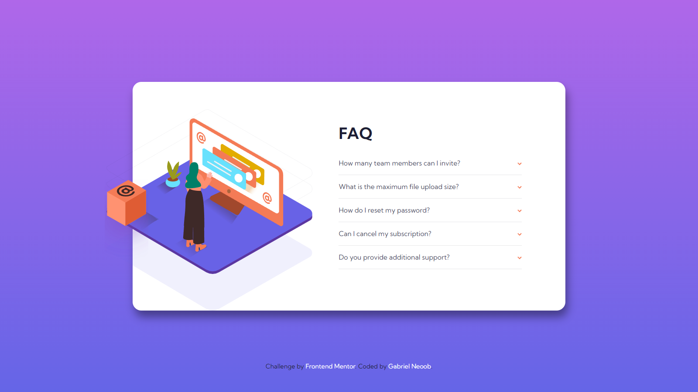

# Frontend Mentor - FAQ accordion card solution

This is a solution to the [FAQ accordion card challenge on Frontend Mentor](https://www.frontendmentor.io/challenges/faq-accordion-card-XlyjD0Oam). Frontend Mentor challenges help you improve your coding skills by building realistic projects. 

## Table of contents

- [Overview](#overview)
  - [The challenge](#the-challenge)
  - [Screenshot](#screenshot)
  - [Links](#links)
- [My process](#my-process)
  - [Built with](#built-with)
  - [What I learned](#what-i-learned)
- [Author](#author)

## Overview

### The challenge

Users should be able to:

- View the optimal layout for the component depending on their device's screen size
- See hover states for all interactive elements on the page
- Hide/Show the answer to a question when the question is clicked

### Screenshot



### Links

- Solution URL: [https://github.com/gabrielneoob/faq-according-card](https://github.com/gabrielneoob/faq-according-card)
- Live Site URL: [https://gabrielneoob.github.io/faq-according-card/](https://gabrielneoob.github.io/faq-according-card/)

## My process

### Built with

- JavaScript
- DOM

- Semantic HTML5 markup
- CSS custom properties
- Flexbox
- CSS Grid
- Mobile-first workflow

### What I learned

I learned the basic how to manipulate DOM with JavaScript

```javascript
answers.forEach((item,index) => {
  item.addEventListener('click', () => {
    if(item.childNodes[3].classList.contains('active')) {
    item.childNodes[3].classList.remove('active');
  } else {
    item.childNodes[3].classList.add('active');
  }
    if(item.childNodes[1].classList.contains('bold')) {
      item.childNodes[1].classList.remove('bold');
    } else {
      item.childNodes[1].classList.add('bold');
    }
    if(arrow[index].classList.contains('arrowWrapper')){
      arrow[index].classList.remove('arrowWrapper');
    } else {
      arrow[index].classList.add('arrowWrapper');
    }
  })
});
```
### Continued development

Improve my skills with DOM and JavaScript

### Useful resources

## Author

- Linkedin - [Gabriel Neoob](https://www.linkedin.com/in/gabriel-neoob/)
- Frontend Mentor - [@gabrielneoob](https://www.frontendmentor.io/profile/gabrielneoob)
